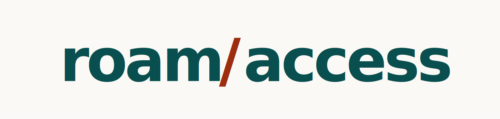

<p align="center">
  
</p>

<p align="center">
  <strong>Find venues that actually work for you.</strong><br />
  Australia's first accessibility discovery platform, built with and for the disability community.
</p>

<p align="center">
  🌐 <a href="https://roamaccess.com.au">roamaccess.com.au</a> &nbsp;·&nbsp; Status: <strong>pre-launch</strong> (in research, launching 2026)
</p>

---

## What is Roam Access?

Roam Access helps people with disability (PWD) discover, review and share venues
across Australia based on **real accessibility**, not what venues claim, but what
they actually deliver. It is built with the disability community, for the
disability community.

This repository currently holds the **pre-launch landing page**. Its three jobs:

1. Be a credibility anchor for grant applications and outreach.
2. Drive visitors to the user-research survey (primary call to action).
3. Capture email signups from interested PWD and venues.

> **Heads up:** this repo will grow into the **monorepo** for the whole project
> once product development starts. See [Where this is heading](#where-this-is-heading).

---

## Tech stack

Plain **static HTML/CSS/JS**, no build step. Tailwind is loaded via the Play CDN
and fonts (Inter + JetBrains Mono) from Google Fonts, so the whole thing is just
files that can be opened or served anywhere. That is what makes it trivially
hostable on GitHub Pages today.

| Concern | Choice |
| --- | --- |
| Markup | Semantic HTML5 |
| Styling | Tailwind (Play CDN) + a small custom CSS layer with design tokens |
| Fonts | Inter (UI/body), JetBrains Mono (numbers, eyebrows) |
| Hosting | GitHub Pages, custom domain `roamaccess.com.au` |
| Forms | Google Forms (newsletter + research + venue interest) |
| Analytics | None yet (privacy-respecting analytics planned) |

---

## Repository structure (today)

```
.
├── index.html          # landing page (self-contained: SEO meta, JSON-LD, a11y)
├── privacy.html        # Privacy Policy
├── accessibility.html  # Accessibility Statement
├── 404.html            # branded, noindex "page not found"
├── robots.txt          # allows all crawlers; points to the sitemap
├── sitemap.xml         # XML sitemap (home + legal pages)
├── CNAME               # custom domain for GitHub Pages (roamaccess.com.au)
├── .nojekyll           # serve files as-is (skip Jekyll)
├── assets/
│   ├── roam-appicon-teal.svg    # favicon (scalable)
│   ├── roam-appicon-teal.png    # favicon / apple-touch-icon fallback
│   ├── roam-logo-primary.png    # logo (Organization.logo in JSON-LD)
│   └── roam-og.png              # 1200x630 social-share image (og:image)
└── README.md
```

## Where this is heading

When product development begins, this repo becomes a **monorepo**. The likely
shape (subject to change as the team forms):

```
roam-access/
├── apps/
│   ├── web/        # marketing site + this landing page
│   ├── app/        # the Roam Access product (PWA / native)
│   └── api/        # backend services
├── packages/
│   ├── ui/         # shared design system (brand tokens + components)
│   └── config/     # shared lint / ts / build config
├── package.json    # workspace root
└── README.md
```

Today the landing page lives at the repo **root** so GitHub Pages can serve it
with zero config. When the monorepo lands, the landing page moves under
`apps/web` and Pages deploys via a GitHub Actions workflow instead.

---

## Design tokens

The brand palette is WCAG-validated and shared across every surface (and will
seed the future `packages/ui` design system). Contrast ratios are measured on
the paper background.

| Token | Hex | Use | Contrast |
| --- | --- | --- | --- |
| Teal | `#0A4F4F` | primary brand, CTAs, headings | 8.89:1 (AAA) |
| Teal deep | `#073838` | button hover | n/a |
| Rust | `#9C2D0E` | accent, the `/` slash, secondary CTAs | 7.14:1 (AA) |
| Paper | `#FAF9F6` | primary background | n/a |
| Stone | `#EDEAE2` | secondary background | n/a |
| Charcoal | `#1A1A1A` | body text | 16.1:1 (AAA) |
| Slate | `#5A5651` | secondary text | 6.91:1 (AAA) |
| Hairline | `#E5E2DA` | borders | n/a |

The palette was checked against the four common types of colour vision
deficiency (deuteranopia, protanopia, tritanopia, achromatopsia). Rule:
**colour is never the only signal**, it is always paired with text or an icon.

---

## Local development

No tooling required. Open `index.html` in a browser, or serve the folder:

```bash
python3 -m http.server 8000
# then visit http://localhost:8000
```

---

## Deployment

Hosted on **GitHub Pages** from the `main` branch, `/ (root)` folder. Pushing to
`main` redeploys automatically; no Actions workflow needed.

**Custom domain (`roamaccess.com.au`):** the `CNAME` file already configures it.
Point DNS at GitHub Pages with these apex records, then tick **Enforce HTTPS** in
Settings → Pages once the certificate is issued:

```
A     185.199.108.153
A     185.199.109.153
A     185.199.110.153
A     185.199.111.153
AAAA  2606:50c0:8000::153
AAAA  2606:50c0:8001::153
AAAA  2606:50c0:8002::153
AAAA  2606:50c0:8003::153
```

If the domain ever changes, find-and-replace `roamaccess.com.au` across
`index.html`, `privacy.html`, `accessibility.html`, `404.html`, `sitemap.xml`,
`robots.txt` and `CNAME`.

---

## Accessibility (the whole point)

This is an accessibility brand, so the site is built to be exemplary: **WCAG 2.2
AA** as the floor, AAA where reachable. Highlights:

- A **built-in accessibility settings panel**: text size (100/112/125/150%),
  higher-contrast mode and a reduce-motion override, persisted per device.
- Three skip links, semantic landmarks, one `<h1>` with logical heading order.
- Visible, background-aware focus indicators; 48px+ tap targets; 18px+ body text.
- Always-underlined links, `aria-current` nav, `prefers-reduced-motion` and
  `prefers-contrast` support.
- Accessible form: visible label, plain-English validation, `aria-live` success.
- A "Need this in another format?" offer in the footer.

The public commitment, with known gaps, lives in
[`accessibility.html`](accessibility.html). Working principle: **if it is not
accessible, it is not done.**

---

## SEO

On-page SEO is built in and absolute to `https://roamaccess.com.au/`: tuned title
and meta description, canonical + `hreflang`, Open Graph / Twitter tags with a
purpose-built 1200x630 share image, Schema.org JSON-LD (`Organization` +
`WebSite` + `WebPage`, with social profiles in `sameAs`), `robots.txt`, an XML
`sitemap.xml`, and a `noindex` 404 page.

After go-live: verify the domain in Google Search Console + Bing, submit the
sitemap, and check the share card in the Facebook and LinkedIn debuggers.

---

## Pre-launch checklist

- [ ] Configure DNS for `roamaccess.com.au` and enable Enforce HTTPS.
- [ ] Fill the **ABN** placeholders (footer + Privacy Policy).
- [ ] Reconcile the Privacy Policy with reality (analytics provider, mailing-list
      provider, hosting) before publishing it as fact.
- [ ] Add the real **Privacy Policy** body where products collect more data at launch.
- [ ] Install privacy-respecting analytics (e.g. Plausible) if/when wanted.

---

## Forms

The site talks to three Google Forms:

| Action | Where | Form |
| --- | --- | --- |
| Research survey | "Take the survey" CTAs | `forms.gle/2vSfnNySe9ycRjys9` |
| Venue interest | "Register your interest" | `forms.gle/UmEkrXcyvNmVSdXm8` |
| Newsletter | "Stay in the loop" | posts to the form's `formResponse` endpoint |

The newsletter form submits silently via `fetch` (no page reload) and falls back
to a normal POST if JavaScript is off.

---

## Contributing

Once the team forms, contributions go through pull requests. Two non-negotiables:

1. **Accessibility first.** Every change keeps the site WCAG 2.2 AA or better.
   Test with the keyboard, a screen reader, and at 200% zoom.
2. **Honest, plain English.** Follow the brand voice: warm, direct, no jargon,
   and never overselling where we are.

---

## Contact

- **Email:** helloroamaccess@gmail.com
- **LinkedIn:** https://www.linkedin.com/company/roam-access
- **Instagram:** https://www.instagram.com/roamaccess/

---

## License

© 2026 Roam Access. All rights reserved. Open-source licensing is to be decided;
ask before reusing.
